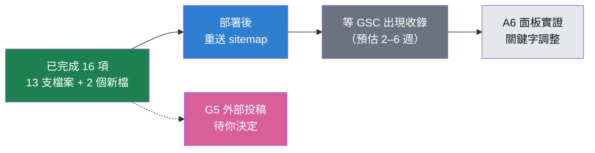

# AEO / SEO / GEO 工作計劃

2026-09-16 擬定並執行。站台 2026-09-15 上線，以下數字全部為當日實測。

**執行狀態：16 項已完成並驗收。剩 2 項——G5 對外投稿要你決定，A6 要等 GSC 有收錄資料才驗得了。**

擬定時有兩條前提是錯的，執行前實測推翻，做法已改：

- **S3「`/crop/` 只連 174 個、要連滿 1,339」** → 錯。`index.json` 只有 356 個品項、其中
  173 個可收錄，`/crop/` 已經全部列出。那 1,339 是把品項×市場頁一起算進去的。
  真正的缺口是 **3,043 個品項×市場頁彼此不相連**，改成做這個。
- **S4「`/meat/` 在第 3 層」** → 錯。實測是深度 2（首頁 → `/crop/` → `/meat/x/`）。
  真正的問題是**入鏈只有 1 個**（只有 `/crop/` 連得到），改成補互連，不新增 `/meat/` 索引頁
  ——那會跟 `/crop/` 的肉蛋分頁重複，多一個薄頁面對收錄是扣分。

## 0. 三軸在這個站分別是什麼

| 軸 | 目標 | 這站的判準 |
|---|---|---|
| **SEO** | 被 Google 收錄、在結果頁排得到 | 1,380 頁送出、**目前收錄 0**。瓶頸是收錄速度與內部連結，不是關鍵字 |
| **AEO** | 成為 AI Overviews／精選摘要那一段**直接答案** | 站台本來就在回答「現在貴嗎」，但答案散在卡片與圖表裡，沒有一句自足的話讓引擎抄 |
| **GEO** | 被 ChatGPT／Claude／Perplexity **引用**時前提不被講錯 | 爬蟲拿得到內容（實測 ClaudeBot 200），但沒有任何地方說明「只有 19 個行情報導站、臺南只有花卉、批發元/公斤 vs 零售元/台斤」 |

三軸共用同一批頁面，但要修的東西不同，所以分開排。

## 1. 現況基準（2026-09-16）

**GSC（`sc-domain:hokhong.tw`）**：sitemap 09-15 12:26 送出並下載成功，0 errors / 0 warnings；submitted **1,380**、indexed **0**。近 30 天 `searchAnalytics` 的 query / page / date 三個維度都是空集合，曝光 0、點擊 0。

**GA4（property 553897299）**：09-15 共 10 sessions、09-16 共 6，合計 16。來源 `(direct)/(none)` 13、`(not set)` 9，organic **0**。

**兩邊對得起來**：GSC 曝光 0、GA 16 session，差額全部是自己開站測試。上線未滿 48 小時，不是異常。所以本計劃不含任何關鍵字層級的調整——沒有資料可調。

**技術基準**：改動前 → 改動後（皆為 `dist/` 實測）

| 指標 | 改動前 | 改動後 |
|---|---|---|
| JSON-LD | 0 頁 | **1,395 頁**（= 全部可收錄頁；noindex 頁刻意不給） |
| `og:image` | 0 頁 | 3,462 頁 |
| 有 `h2` 的頁 | 2 頁 | 3,462 頁 |
| 表格 `<caption>` | 0 頁 | 3,456 頁 |
| 只有 1 個入鏈的可收錄頁 | 1,201 | **0** |
| 可收錄頁入鏈中位數 | 1 | **15** |
| 市場頁入鏈（最少） | 1 | 30 |
| 肉蛋頁入鏈 | 1 | 16 |
| sitemap `lastmod` | `new Date()`，每天刷新 | `2026-09-11`（資料最後交易日） |
| `llms.txt` | 無 | 4,545 bytes |

良好、沒有動的：title 與 description 已帶實際數字（「高麗菜現在貴嗎？便宜 25%」）；內容伺服器端渲染，不跑 JS 也讀得到數字；線上 35 KB / 0.22 s。

點擊深度維持 890 頁在第 3 層——那是 `/crop/{品項}/{市場}/` 這個網址結構本來就決定的，
互連是橫向的、拉不上來。入鏈數才是這批頁面原本的瓶頸，深度 3 本身不是問題。

---

## 2. SEO 工作項

目標：把 indexed 從 0 推上去。收錄不發生，另外兩軸做了也沒用，所以這一軸先做。

| # | 任務 | 動到 | 狀態 |
|---|---|---|---|
| S1 | **`lastmod` 改成每頁真實資料日期**。現在 `lastmod: new Date()`，1,395 筆全同值、每天 build 刷新，等於宣告「全站每天都改」，Google 會停止採信這個欄位，回訪反而變慢。改成從 `data/page/page-state.ndjson` 取該頁最後一次資料變動日 | `astro.config.mjs` | **已完成**。改讀 `index.json` 的 `lastDate`，資料沒更新就不會動 |
| S2 | **補內部連結**。1,201 個可收錄頁只有 1 個入鏈。品項頁加「同分類品項」橫向連結（6–8 個）；市場頁列出該市場主要品項頁 | `crop/[slug].astro`、`market/[slug].astro` | **已完成**。入鏈 1 的可收錄頁 1,201 → **0**，中位數 15 |
| S3 | **`/crop/` 索引連滿**。目前只輸出 174 個連結，但有 1,339 個可收錄品項頁。補完整分類清單（視覺可摺疊，連結要在 HTML 裡） | `crop/index.astro` | **前提有誤，已改做**：`/crop/` 本來就列滿了；改成補品項×市場頁的互連 |
| S4 | **`/meat/` 是孤島**。16 頁在 sitemap，但沒有索引頁，導覽列沒有它，只有 `/crop/index.html` 連過去。雞蛋是社會關注度最高的單一品項，卻在第 3 層。新增 `/meat/` 索引頁並加進導覽列與首頁 | 新增 `src/pages/meat/index.astro`、`Base.astro`、`index.astro` | **前提有誤，已改做**：本來就是深度 2；改成補肉蛋頁互連，入鏈 1 → 16 |
| S5 | **`BreadcrumbList` JSON-LD**。全站 0 個結構化資料。麵包屑是最低成本的一個，且直接影響結果頁的呈現 | `Base.astro` | **已完成**。1,394 頁（首頁是根，沒有麵包屑） |
| S6 | **`og:image`**。0 頁有。用品項頁現成走勢圖產靜態 OG 圖，最低限度先做一張全站通用圖。影響分享點擊率，也是取得外部連結的起點 | `Base.astro` + 產圖腳本 | **已完成**。3,462 頁，用站台圖示；帶數字的圖見下方待辦 |
| S7 | **首頁補資料來源頁尾**。首頁是 `bare` 模式，導覽列有（自己做的一套），但沒有 `Base.astro` 頁尾的來源聲明與最新交易日 | `index.astro` | **已完成**。首頁頁尾補上來源機關、授權、單位與更新日 |

## 3. AEO 工作項

目標：讓引擎有一段可以整段抄走的答案。現在品項頁的 h1 是「高麗菜 比平常便宜」，**數字不在 h1 裡**，要往下讀四張卡片才拼得出答案。

| # | 任務 | 動到 | 狀態 |
|---|---|---|---|
| A1 | **答案句**。每個品項頁、市場頁、肉品頁在 h1 正下方放一句自足的話，人與引擎都能單獨成立：「高麗菜目前全國批發加權均價 26.9 元/公斤，比近三年同期便宜 25%；台中公有市場零售實測 48 元/台斤。資料截至 2026-09-15。」品名、數字、單位、比較基準、日期五件事同句 | `crop/[slug].astro`、`crop/[slug]/[market].astro`、`market/[slug].astro`、`meat/[slug].astro` | **已完成**。品項／品項×市場／市場／肉蛋／榜單五種頁型都有 |
| A2 | **`h2` 改成問句**。全站 `h2` 只有 2 頁、`h3` 0 頁。分頁標籤「14 年走勢／跟往年比／近 90 天／各地價差／為什麼貴」現在是 `<label>`，對引擎是無結構文字。面板內各放一個真的 `h2`，用使用者實際會打的問法：「高麗菜現在多少錢？」「比去年同期貴還是便宜？」「哪個市場最便宜？」`<label>` 保留互動用途 | 同 A1 四支模板 | **已完成**。3,462 頁，每個面板一個問句 `h2` |
| A3 | **`FAQPage` JSON-LD**。品項頁 3–4 題，答案取自頁面上已有的數字，不另寫內容 | `crop/[slug].astro` | **已完成**。189 頁（品項 173 + 肉蛋 16），答案全部取自頁面既有數字 |
| A4 | **表格語意**。品項頁有 177 列的月均價表，這是精選摘要最愛抓的形狀，但要有 `<caption>` 與 `<th scope>` 才抓得準 | 表格輸出處（`crop/[slug].astro`、`[market].astro`） | **已完成**。3,456 頁有 `<caption>`，首欄改 `th scope="row"` |
| A5 | **890 個品項×市場頁的 description 帶數字**。現在共用樣板句「X 在 Y 的批發行情走勢，並與全國均價對照。」品項頁已證明帶數字可行：「高麗菜在台北二最新月均價 24.0 元/公斤，比全國均價低 11.1%。」 | `crop/[slug]/[market].astro` | **已完成**。例：「高麗菜在台北二最新月均價 24.0 元/公斤，比全國同月低 11.1%。」 |
| A6 | **確認 `display:none` 面板的收錄情況**。面板用純 CSS `display:none` 切換，Google 通常仍索引但權重較低。**等 GSC 有收錄資料後**用網址檢查工具比對已檢索的 HTML，再決定要不要改成預設全開、改用 JS 收合。在拿到實證前不要動——現在改是猜 | — | **待辦**：需要 GSC 有收錄記錄才驗得了，現在改是猜 |

## 4. GEO 工作項

目標：被生成引擎引用時，不要把前提講錯。這站的資料有四個很容易被誤引的限制，現在全站沒有一處機器可讀地說明。

| # | 任務 | 動到 | 狀態 |
|---|---|---|---|
| G1 | **`llms.txt`**。寫明：站台回答什麼問題；涵蓋 19 個農糧署行情報導站、不是全台 47 家批發市場；臺南沒有蔬果行情、只有花卉；批發價為交易量加權平均、元/公斤；零售價只有臺中市公有零售市場、元/台斤，124 個可買品項中只有 28 項有；資料自民國 101 年起；每日更新；授權為政府資料開放授權條款第 1 版。這是目前生成引擎讀得最省事的一份說明 | 新增 `public/llms.txt` | **已完成**。4,545 bytes，八條最常被講錯的前提寫在最前面 |
| G2 | **`Dataset` JSON-LD**。這站的本體就是資料集，`Dataset` 是最貼的型別，且 Google 有 Dataset 專屬搜尋介面。欄位帶 `temporalCoverage`（2012 起）、`spatialCoverage`、`creator`（農業部農糧署）、`license`（政府資料開放授權條款第 1 版）、`distribution`。這些欄位正好就是 G1 那些前提的機器可讀版本 | `crop/[slug].astro`、`market/[slug].astro`、`meat/[slug].astro` | **已完成**。1,391 頁。肉蛋的 `creator` 換成農業部／中央畜產會，`isBasedOn` 跟著換 |
| G3 | **數字旁固定帶日期與單位**。生成引擎引用時最常掉的就是「什麼時候的、什麼單位」。頁面上每個主數字旁要有截止日與單位，不能只靠頁尾一句「最新交易日」 | 同 A1 四支模板 | **已完成**。答案句五件事同句；肉蛋頁另修掉「一律寫近三年」的錯（雞蛋只有 1 年） |
| G4 | **`robots.txt` 明列 AI 爬蟲**。目前 `User-agent: * Allow: /` 已允許（實測 ClaudeBot 取品項頁 200），但明列 GPTBot／ClaudeBot／PerplexityBot／Google-Extended／CCBot 是宣告意圖，避免日後有人誤加封鎖 | `public/robots.txt` | **已完成**。14 個 UA 區塊，含 GPTBot／ClaudeBot／PerplexityBot／Google-Extended 等 |
| G5 | **外部訊號**。新站 0 收錄的另一個瓶頸是沒有任何外部連結。切入點是本站獨有的：官方平台只留兩年，這裡有民國 101 年起 15 年，且做了產地→批發→零售的縱向對照。**這件事要對外發送，需要你決定，我不代發** | — | **待你決定** |

## 5. 改了哪些檔

| 檔案 | 改了什麼 |
|---|---|
| `astro.config.mjs` | S1：`lastmod` 改讀資料最後交易日 |
| `src/layouts/Base.astro` | S5 S6 G2 A3：JSON-LD（WebSite／BreadcrumbList／Dataset／FAQPage）、`og:image`、`og:site_name`、`twitter:card` |
| `src/components/PriceLine.astro` | A4：表格 `<caption>` 與 `th scope` |
| `src/pages/crop/[slug].astro` | A1 A2 A3 G2 G3 S5 |
| `src/pages/crop/[slug]/[market].astro` | A1 A2 A5 G2 G3 S2（同品項其他市場互連、回連市場頁） |
| `src/pages/market/[slug].astro` | A1 A2 G2 G3 S2（主力品項連到品項×市場頁） |
| `src/pages/meat/[slug].astro` | A1 A2 A3 G2 G3 S2（肉蛋互連）、修掉「一律近三年」的錯 |
| `src/pages/index.astro` | S7：頁尾補來源機關、授權、單位 |
| `src/pages/{cheap,about}.astro`、`crop/index.astro`、`market/index.astro` | A1 A2 S5 |
| `src/styles/site.css` | `.siblings` 互連區塊、`tbody th` 字重、`.home-src` |
| `public/robots.txt` | G4：14 個 AI 爬蟲 UA 區塊 |
| `public/llms.txt`（新） | G1 |
| `SEO.md`（新） | 本文件 |

版面有實測：桌機 1440 的品項×市場頁、手機寬度的首頁都截圖看過，互連區塊與新頁尾都沒有撐破既有版面。答案句與各面板 `h2` 走 `sr-only`——那些數字畫面上都已經在（KPI 卡、分頁列），重複顯示會佔掉版面，但引擎與螢幕閱讀器需要一個不必自己拼的句子。

## 6. 監看

每週抓一次，看趨勢不看單日：

| 指標 | 今天 | 意義 |
|---|---|---|
| GSC sitemap `contents[0].indexed` | 0 / 1,380 | 開始上升 = 收錄啟動，這批改動有效 |
| GSC `searchAnalytics` date 維度曝光 | 0 | 有數字才做得了 A6 與關鍵字調整 |
| GA4 `sessionSourceMedium` 的 `google / organic` | 0 | 與 GSC 點擊對照，落差大再查追蹤碼 |

取數方式見 memory `gcp-ga-gsc-access`：不下載金鑰，以 gcloud token 模擬 `hokhong-index@hokhong-tw.iam.gserviceaccount.com`，帶 `webmasters.readonly` / `analytics.readonly` scope。
