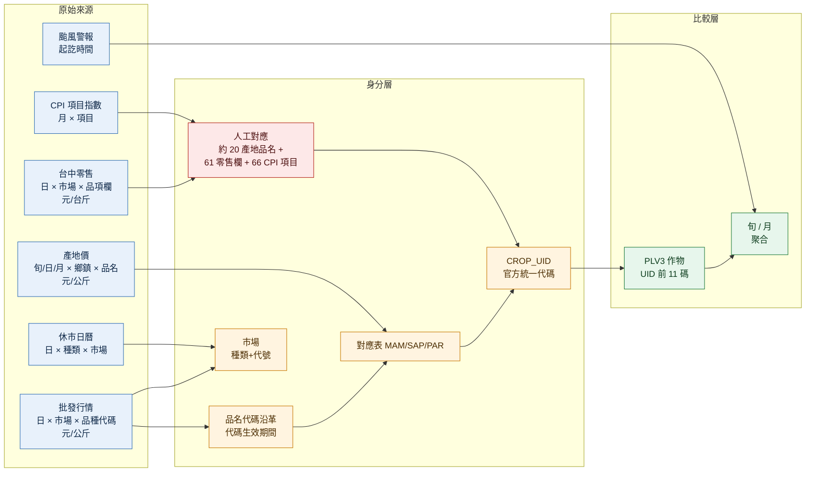

# 外部資料源實測報告

實測日期：2026-09-11（民國 115）。User-Agent：`hokhong.tw-ingest/0.1 (+https://hokhong.tw)`。
所有端點都實際打過，筆數與欄位都是實測輸出。取得程式在 `ingest/sources/`，原始檔在 `ingest/raw/`。

---

## 0. 結論先講

1. **批發行情可以完整取得**：`data.moa.gov.tw` 的 `FromM/FarmTransData.aspx` 免金鑰，最早資料是 **101.01.03**（README 寫的 100 年整年都是 0 筆）。
2. **作物身分的 cluster 工作，官方已經做了大半**：「農作物統一代碼」加上「各系統代碼對應」兩張表，把批發市場（MAM）、產地價（SAP）、農情調查（PAR）等 10 個系統都掛到同一個 `CROP_UID` 下。
3. **產地價有開放資料**（README 原本以為要登入）：2012–2026 共 368,059 筆，有旬價、日價、月價三種。
4. **休市有官方日曆**，而且預排到當年 12 月，可以分出「休市」和「未上傳」（溪湖鎮蔬菜的日曆不準，除外）。
5. **README 提到「平台筆數少於原系統」的問題，現況已經不存在**：115/09/08 蔬菜 AMIS 1615 筆、開放平台 1615 筆，完全一致。
6. **歷史作物名稱被改寫、`rest` 記錄時有時無**：API 用現行名稱改寫歷史資料，代碼生效期間只能靠「品名代碼沿革」；休市要以官方日曆為準（§7）。
7. 全史回補完成：2012-01-01～2026-09-12，14,694,536 筆，gzip 後 373 MB。
8. 零售端最弱：只有台中市有每日零售價（14 個市場、61 個品項（含魚、肉、蛋）、只保留近一年），全國層級只有主計總處的月 CPI 指數（是指數，不是價格）。

---

## 1. 批發行情 `farm-trans`

| 項目 | 實測 |
|---|---|
| 端點 | `https://data.moa.gov.tw/Service/OpenData/FromM/FarmTransData.aspx?$top=10000&$skip=0&StartDate=115.09.08&EndDate=115.09.08` |
| 舊網域 | `data.coa.gov.tw` DNS 已解析不到。**資料集頁面上的範例 URL 仍然是舊網域** |
| 單次上限 | 10000 筆；結果超過時回 `[{"errMsg":"您所要求的資料量已超過10000筆…"}]`，不是截斷 |
| 分頁 | `$top`/`$skip` 有效（7 天 18,918 筆分 4 頁取回無遺漏） |
| 無日期參數 | 預設回傳近 4 天，但**被 9999 筆截斷**（實測 4 天共 9999 筆，明顯不完整）→ 一定要帶日期 |
| 最早資料 | 101.01.03；100 年任何一天都是 0 筆 |
| 每日量 | 平日約 3,500 筆，壓縮後約 90 KB；單日請求約 6–11 秒 |
| 數值型別 | **現在是 number**（`15.2`、`2258.0`），README 說「全是字串」已經不是事實 |
| 小數 | 開放平台 2 位小數，AMIS 網頁顯示 1 位（四捨五入） |

### 資料形狀的新發現

- **種類代碼**：`N04` 蔬菜、`N05` 水果、`N06` 花卉。
- **市場代號不是唯一鍵**：`400` 同時是「台中市」（蔬果）和「台中市場」（花卉），`514` 是「溪湖鎮」與「彰化市場」，`800` 是「高雄市」與「高雄市場」。**市場身分要用 (種類代碼, 市場代號)**。
- **休市假記錄是每個種類各一筆**：同一市場同一天會有 `N04` 和 `N06` 兩筆 `rest`。觀察鍵要是 (日期, 種類, 市場, 作物代號)。
- **有 `種類代碼: null`、`作物名稱: null` 的列**：例如台北市場的 `FE800`、`FE810`。115/09/01–07 共 99 筆，集中在 105、400、514、700、800 這幾個有花卉的市場代號（另有板橋區 1 筆）。
- **當日資料分批到達**：115/09/11 21:44 重抓仍只有 1,922 筆，桃農、台中市、宜蘭、台東、花蓮、西螺、嘉義都還沒到，官方休市日曆上這些市場當天也沒有休市。隔天 01:34 重抓仍是 1,922 筆 → 有市場延遲超過一天（§7 第 1 項）。另外 **`rest` 記錄會提前發布**：115/09/12 凌晨 01:34 就已經有 6 筆當天的 `rest`。
- **有負的交易量**：全史 1,469 萬列中有 6 列交易量是負數（合計 −243 公斤，最負 −130，例如 `107.12.29` 的 `SD9`、`106.08.09` 的 `MC1`）。量極小可以忽略，但代表來源沒有做基本的值域檢查，轉換層一律要用 `交易量 > 0` 過濾。
- **交易量為 0 但有價格的列有 101,333 筆**（0.69%）：這些不是休市（休市是 `rest`），是有報價無成交。做加權平均時會被自動排除（權重 0），但算「有幾天有交易」時要記得扣掉。

### API v1（`/api/v1/AgriProductsTransType/`）不適合大量取用

`https://data.moa.gov.tw/openapi.json` 列出了 `/api/v1/*` 共 60 支 API，但**非會員只給第一頁**（1000 筆，`Page=2` 回 `非會員只限回傳第一頁資料`）。欄位改成英文（`TransDate`、`TcType`、`Avg_Price`…），內容相同。結論：大量取用走 `FromM`，不需要申請會員。

---

## 2. 作物身分：統一代碼與對應表

| 資料集 | 端點 | 筆數 |
|---|---|---|
| 農作物統一名稱與代碼 `crop-unified` | `Service/OpenData/TransService.aspx?UnitId=LC7YWlenhLuP` | 4,370 |
| 統一代碼與各系統代碼對應 `crop-crosswalk` | `Service/OpenData/TransService.aspx?UnitId=xVOXUErUYXJK` | 5,207 |
| 品名代碼沿革 `amis-product-changed` | `https://amis.afa.gov.tw/main/ProductChanged.aspx`（HTML） | 126 |

`CROP_UID` 是 17 碼階層碼：`PLV1`(3 碼，大類) + `PLV2`(2，中類) + `PLV5`(3，科) + `PLV3`(3，作物) + `PLV4`(4，品種) + `PLV6`(2)。4370 筆中有 4369 筆符合這個組法，例外只有 `00601171017000000` 一筆。

對應表涵蓋的系統：

| SRC_SYS_ID | 系統 | 筆數 |
|---|---|---|
| MAM | 農產品批發市場交易行情站 | 2,142 |
| PQR | 溯源農糧產品追溯系統 | 758 |
| PSC | 農糧產品產銷供應鏈整合服務平台 | 545 |
| FFR | 全國糧政跨區即時申辦服務作業平台 | 489 |
| PMG | 農業產銷班組織體系資料服務系統 | 327 |
| PAR | 農糧情調查作業資訊系統 | 271 |
| PFB | 農產業天然災害現金救助系統 | 251 |
| SAP | 農產品產地價格查詢系統 | 238 |
| SAC | 農產品生產成本調查系統 | 182 |
| CMV | 敏感性蔬菜種植登記暨預警資訊系統 | 4 |

**批發代碼的對應覆蓋率**（以 2026-09-01、02、08、09 四天的交易量加權）：

| 種類 | 代碼數 | 對應到的代碼 | 交易量覆蓋 |
|---|---|---|---|
| N04 蔬菜 | 298 | 274（92%） | 90.0% |
| N05 水果 | 132 | 126（95%） | 98.5% |
| N06 花卉 | 531 | 227（43%） | 40.9% |

對不到的主要是 **114 年新增的進口細分代碼**（`LA91` 甘藍-進口 初秋、`LA92`、`LC93`、`FT97`…），以及 `OX1`、`91` 這類「其他」。品名代碼沿革顯示 114 年一次新增了大量 `-進口` 細項，原本的 `LA9 甘藍-進口` 被拆開。這些可以用「前綴 + 進口」規則補，或等官方更新對應表。

**批發對到品種層，產地價對到作物層**：`LA1 甘藍 初秋 → 00201002001000100`，產地價 `甘藍 → 00201002001000000`。所以三層價格要在 **PLV3（UID 前 11 碼）** 對齊。

**種類代碼與官方作物分類不是同一套**（實測，做分類頁前要知道）：交易行情站的 `N04/N05/N06`（蔬菜／水果／花卉）與統一代碼的 `PLV1_NAME`（蔬菜類／果樹類／花卉類／雜糧類／特用作物類…）不對齊。96 個代碼跨類、占交易量 10.8%：

| 代碼 | 交易站種類 | 官方分類 |
|---|---|---|
| `T1` 西瓜-大西瓜、`T5` 西瓜-黃肉 | N05 水果 | 蔬菜類 |
| `FY6` 玉米-甜軟殼 | N04 蔬菜 | 雜糧類 |
| `SZ8` 香茅 | N04 蔬菜 | 特用作物類 |

站上的分類頁建議以交易站的 `N04/N05/N06` 為主軸（使用者的心智模型就是蔬菜水果花卉），`PLV1` 只當作物學分類的補充資訊。**不能用 `PLV1` 去驗證官方對應表對不對**——它們是兩套獨立的分類，不一致是預期現象。但反過來，**自己推導的對應一定要用種類檢查擋**：代碼前綴在種類之間會重複（`FB1` 蔬菜花椰菜 vs `FB106` 花卉火鶴花），不擋就會把火鶴花的價格算進花椰菜。

**代碼會被重複使用**（品名代碼沿革）：

- `G2`：原本是鳳眼果，103 年改成黃金果
- `G5`：原本是人心果，103 年改成香瓜梨
- `SQ1`/`SQ2`：101 年兩個代碼合併成 `SQ1 帶殼`，`SQ2` 刪除
- 單純更名、代碼不變：鴻禧菇→鴻喜菇（113）、火龍果→紅龍果（113）、椪柑→柑橘（113）

→ 作物 entity 的鍵要是 **(種類, 代碼, 生效期間)**，不能只用代碼。而且 API 回傳的歷史資料名稱已被改寫成現行名稱（見 §7 第 3 項），生效期間只能從這張沿革表來。

---

## 3. 產地價

| 資料集 | 端點 | 實測 |
|---|---|---|
| 農產品產地價格資料 `origin-price` | `Service/OpenData/TransService.aspx?UnitId=WVOiWSdDjWxx`（`$top`/`$skip` 分頁） | 368,059 筆，2012–2026，166 個品名，202 個 `ORGNAME` |
| 農產品產地價格（月平均） `origin-price-monthly` | `Service/OpenData/DataFileService.aspx?UnitId=652` | 4,331 筆，1998–2026，207 個作物，寬表（1 月價格…12 月價格） |

`origin-price` 欄位：`AVGPRICE`、`PRODUCTNAME`、`ORGNAME`、`YEAR`、`MONTH`、`PERIOD`，全部是字串。

- `PERIOD` 有三種：`上旬`／`中旬`／`下旬`（235,786 筆）、空字串＝月價（97,840 筆）、`01`–`31`＝日價（34,433 筆，`ORGNAME` 固定是 `當日平均價`）。
- `ORGNAME` 是 `縣市_鄉鎮`（例如 `南投縣_埔里鎮`），`_` 代表全國平均 → 產地價有**鄉鎮粒度**，可以做產地地圖。
- 日價只涵蓋少數品項：番石榴(珍珠)、青香蕉(內銷)、木瓜、蒜頭、落花生、鳳梨(17號)、柳橙、檸檬、甘藷、蓮霧…
- **沒有代碼，只有品名**。166 個品名中有 146 個能以名稱完全比對到對應表的 SAP `SRC_CNAME`，占 92.4% 的列；對不到的是 `青香蕉(內銷)`、`番荔枝(大目)`、`玫瑰`、`蝴蝶蘭(3.5吋盆)` 這類，需要人工補對應（約 20 個，一次性工作）。
- 月平均表的單位寫在作物名稱裡：`元/公斤` 為主，另有 `元/支`、`元/把`、`元/盆`、`元/粒` → 單位要解析出來，不能假設都是公斤。

---

## 4. 零售價

| 資料集 | 端點 | 實測 | 評估 |
|---|---|---|---|
| 臺中市公有零售市場每日蔬果價格 `taichung-retail` | `https://newdatacenter.taichung.gov.tw/api/v1/no-auth/resource.download?rid=495aff49-3547-4055-aacd-f0781c6f733e` | 4,431 筆；20250912–20260910，只保留近一年；14 個市場；61 個品項（寬表，含魚、肉、蛋）；單位**元/台斤**；`0` = 當日未訪價 | 唯一的每日零售價。**來源只保留一年，要每天抓下來自己累積**，晚一天開始就少一天 |
| 主計總處 消費者物價基本分類暨項目群指數 `dgbas-cpi-items` | `https://ws.dgbas.gov.tw/001/Upload/461/relfile/11525/230543/pr0101a3m.xml` | 2013M01–2026M08，449 個項目；蔬菜有 42 個細項（甘藍菜、小白菜、蘿蔔…）、水果 24 項 | 是**指數**（110 年＝100），不是元/公斤。只能看漲跌幅，不能算價差 |
| 臺北市公有零售市場行情 | data.taipei 資料集 145841，18 個 CSV | 欄位只有 `項目`、`平均（元/台斤）`，**列裡沒有日期**，要靠 CSV 資源名稱推斷期間 | 價值低，暫不取 |

`ws.dgbas.gov.tw` 送出的憑證鏈缺 TWCA 中繼憑證（curl 靠 macOS keychain 過得了，Node 過不了）。已經從憑證 AIA 取得中繼憑證存成 `ingest/certs/twca-secure-ssl-2023g3.pem`，執行時帶 `NODE_EXTRA_CA_CERTS`，沒有關閉 TLS 驗證。

主計總處總體統計資料庫（nstatdb）的首頁沒有找到 API 入口，SDMX 版本**未查證**。

---

## 5. 休市、事件、供給側

| 資料集 | 端點 | 實測 |
|---|---|---|
| 果菜及花卉市場休市 `market-rest-farm` | `Service/OpenData/FromM/MarketRestFarm.aspx` | 5,903 筆，10101–11512（**預排到今年 12 月**），`MarketType` 分蔬菜／水果／花卉，`ClosedDate` 是 `03、07、14…` 字串 |
| 颱風警報列表 `cwa-typhoon-warnings` | `POST https://rdc28.cwa.gov.tw/TDB/public/warning_typhoon_list/get_warning_typhoon`，body `year=all`，要帶 `X-Requested-With: XMLHttpRequest` | 455 次颱風，1958–2026，其中 2012 年後 71 次；含海上警報起訖時間、強度、最低氣壓 |
| 農情預測 `crop-forecast` | `Service/OpenData/TransService.aspx?UnitId=4P84xEv6hd22` | 2,407 則，2017-03 起；是**文字新聞稿**（例如「二期作甘藷種植面積較常年同期增加5%」），不是數字表 |
| 每月盛產農產品產地 `peak-season-origin` | `Service/OpenData/DataFileService.aspx?UnitId=061` | 4,010 筆：月 × 作物 × 品種 × 縣市 × 鄉鎮 → 可以做「當季」標記 |
| 產銷履歷與有機蔬果行情 `tap-trans` | `Service/OpenData/FromM/TAPData.aspx` | 2,356 筆，但**只涵蓋最近 2 天**（實測 20260910–20260911），是滾動視窗 → 按抓取日分檔累積，漏抓 2 天就永久斷檔。欄位是交易金額與交易量（不是單價），`溯源代號` 區分一般／產銷履歷／有機，與一般行情同一套作物代號 |

氣象署 opendata API（`opendata.cwa.gov.tw`）需要會員金鑰（302 導向登入）。颱風資料庫網頁自己用的 JSON 免金鑰，已經足夠做事件標註。

同一平台上**有但這次沒有取**的：漁產品交易行情（`FromM/AquaticTransData.aspx`）、毛豬（`FromM/AnimalTransData.aspx`）、家禽（`FromM/PoultryTransBoiledChickenData.aspx`、`PoultryTransLocalChickenData.aspx`）、全國單日平均糧價（`Ricepriceavg.aspx`）、農產品進出口（`agrstatUnit.aspx?item_code=GA0230…`，COA 代碼）、農作物災害損失（`agrstat_office_result.aspx?report_code=1140-00-01`）。端點都從資料集頁面取得，還沒打過。

---

## 6. 資料怎麼統整

1. **觀察鍵**：批發 = (日期, 種類代碼, 市場代號, 作物代號)。產地 = (年, 月, PERIOD, ORGNAME, PRODUCTNAME)。零售台中 = (訪價日期, 市場名稱, 欄名)。
2. **作物身分**：批發代碼 →（依代碼沿革判斷生效期間）→ 對應表 MAM → `CROP_UID`；產地品名 → 對應表 SAP → `CROP_UID`；零售欄名與 CPI 項目只能人工對到 PLV3。
3. **比較粒度**：三層價格在 **PLV3 × 旬** 或 **PLV3 × 月** 對齊。批發是品種層，要先按交易量加權彙總到 PLV3。
4. **單位**：批發與產地都是元/公斤（產地月表部分品項例外，要從名稱解析）；台中零售是元/台斤，換算要 ÷0.6；CPI 是指數，只能比漲跌幅。
5. **缺值判別**：(種類, 市場, 日) 沒有列時 → 查休市日曆；日曆有 = 休市，日曆沒有 = 未上傳或延遲。`rest` 記錄只當輔助（見 §7 第 4 項），溪湖鎮蔬菜的日曆不可用。
6. **事件**：颱風警報期間對齊到日，當作價格序列的標註。

---

## 7. README §7 的七個問題

| # | 問題 | 答案 |
|---|---|---|
| 1 | `data.moa.gov.tw` 可用嗎、到達時間、單次上限 | 可用；上限 10000。**部分市場延遲超過一天**：115/09/11 的資料在當天 21:44 與隔天 01:34 都是 1,922 筆，桃農、台中市、宜蘭等市場仍未到（這些市場歷年幾乎天天有交易，日曆上當天也沒休市）。09/04–09/10 七天在 09/11 與 09/12 兩次抓取完全相同（0 筆變動）。→ 每日取得要**固定重抓最近 7 天**，不能只抓當天 |
| 2 | 完整歷史的總量 | 2012-01-01～2026-09-12 共 5,369 天、**14,694,536 筆**，gzip 後 373 MB；每年 88.7 萬～105.7 萬筆。作物代號：N04 460 個、N05 240 個、N06 2,195 個。(種類, 市場代號, 市場名稱) 組合 60 個。7 天完全無資料（每年春節前後 1 天）。無重複鍵 |
| 3 | 代碼重用或改名 | **API 會用現行名稱改寫歷史資料**：2012 年的 `811` 顯示為「紅龍果-白肉」（113 年才從火龍果改名）；民國 102 年的 `G2` 顯示為「黃金果」（103 年前其實是鳳眼果）。所以資料裡「同代碼多個名稱」是 0 筆——不是沒有重用，是看不到。**代碼的生效期間只能靠品名代碼沿革**，G2、G5 在 103 年前的價格要歸到舊作物。「同名多代碼」有 31 組，類型是：品種細分（`SA3`/`SA31`/`SA32` 都叫 蘿蔔-矸仔）、花卉國產／進口字首（`FH467`/`IH467`）、大小寫不一（`X09`/`x09`） |
| 4 | 休市假記錄的規則 | **`rest` 記錄不可靠，休市要以官方日曆為準**。`rest` 只出現在 2015–2020 與 2025–2026，2012–2014、2021–2024 完全沒有。2025 年起還出現種類標錯的 `rest`（例如 N06 台北二、N05 台北市場——這些市場沒有該種類的交易）。全期間 (種類, 市場, 日) 分類：有交易 146,183；有 rest 且日曆休市 13,837；只有 rest 2,320；日曆休市但無列 16,869；**無列且日曆沒休市 19,115**；有交易但日曆說休市 711 |
| 5 | 開放平台 vs 行情站差多少 | 115/09/08 蔬菜完全一致（1615 = 1615）；README 引用的「1000+ vs 200」現況不成立 |
| 6 | 產地價有沒有機器可讀出口 | 有，`WVOiWSdDjWxx`（旬/日/月，鄉鎮粒度）與 `652`（月平均） |
| 7 | CPI 品項能對到幾個批發作物 | CPI 蔬菜 42 項、水果 24 項，名稱都是 PLV3 層級（甘藍菜、蘿蔔…）；是指數不是價格，要人工對應 |

### 逐市場健康狀況（摘自 `farm-trans-stats.json` 的 `restMatrix`）

- **真的有缺漏的市場**（無列且日曆沒休市）：南投市 N04 797 天、永靖鄉 N04 227 天、宜蘭市 N04 130／N05 238 天、台東市 N04 116／N05 328 天、西螺鎮 N04 89 天。台北一、台北二、三重、高雄市幾乎是 0。
- **日曆不準的市場**：溪湖鎮 N04 有 605 天「日曆說休市卻有交易」，溪湖鎮蔬菜的休市日曆不能用。
- **雜訊組合**：N05 屏東市（12 年只有 2 天交易）、N05 花蓮市（9 天）、N05 南投市（14 天）、N04 東勢鎮、N04 嘉義市（只有 rest 記錄）。建 market entity 時以「交易天數」門檻濾掉。
- **起始日不同**：板橋區 2017-04-07 起、豐原區 2016-01-01 起、宜蘭市 2013-05-01 起、台東市 2013-01-01 起 → 市場 entity 的 `activeFrom` 可以直接從資料推出。
- README 提到的西螺鎮止於 112.10.20：現況資料持續到 2026-09-10，已補正。

### 每日取得

- 首次回補：`node ingest/sources/farm-trans.mjs`（2012-01-01 到今天，已存在的日期略過）
- 每日：`node ingest/sources/farm-trans.mjs --refetch <7 天前> <今天>`，比對 manifest 的筆數與內容即可偵測延遲到達與事後修正
- 統計：`node --max-old-space-size=8192 ingest/probe/farm-trans-stats.mjs > ingest/probe/farm-trans-stats.json`（約 45 秒）
